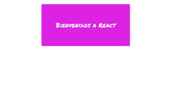

# Random Box usando React

La siguiente página web muestra un contenedor que cambia aleatoriamente de color y estilo de texto que consta de un componente.

### Servidor de desarrollo

>Ejecutar `npm start` para un servidor de desarrollo. Navegue a `http://localhost:3000/`.